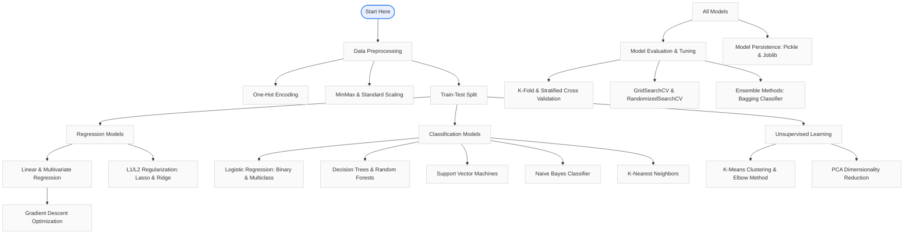

# 🤖 Master Machine Learning: Algorithms & Practical Implementations

<div align="center">

[](https://github.com/amansharma2005/Master-Machine-Learning-Algorithms-Practical-Implementations/stargazers)
[](https://github.com/amansharma2005/Master-Machine-Learning-Algorithms-Practical-Implementations/network/members)
[](https://github.com/amansharma2005/Master-Machine-Learning-Algorithms-Practical-Implementations/issues)
[](https://github.com/amansharma2005/Master-Machine-Learning-Algorithms-Practical-Implementations/blob/main/LICENSE)

<br/>

**A comprehensive, production-grade guide to classical Machine Learning. Detailed implementations of core machine learning algorithms, model-saving techniques, hyperparameter optimization, and ensemble methods—all built from the ground up using Jupyter Notebooks.**

<p align="center">
  <a href="#-machine-learning-learning-path--roadmap">Roadmap</a> •
  <a href="#-summary-of-covered-machine-learning-topics">Topics</a> •
  <a href="#-repository-structure">Repository Structure</a> •
  <a href="#-local-setup-and-installation">Local Setup</a> •
  <a href="#-dataset-prerequisites">Datasets</a>
</p>

### 🛠️ Tech Stack & Technologies Used

[](https://www.python.org/)
[](https://jupyter.org/)
[](https://scikit-learn.org/)
[](https://pandas.pydata.org/)
[](https://numpy.org/)
[](https://matplotlib.org/)
[](https://seaborn.pydata.org/)

</div>

---


## 🗺️ Machine Learning Learning Path & Roadmap

Below is the workflow and learning path followed in this repository, from data preprocessing to advanced ensemble models and tuning:



---

## 📊 Summary of Covered Machine Learning Topics

| Section / Topic | Algorithm / Concept | Libraries Used | Main Dataset | Purpose & Core Concepts |
| :--- | :--- | :--- | :--- | :--- |
| **Regression** | Multivariate Linear Regression | `sklearn.linear_model` | Custom / Home Prices | Predict continuous values; Multi-feature mapping ($y = \sum m_i x_i + b$). |
| **Optimization** | Gradient Descent | Custom NumPy | Synthetic Data | Math behind training; Cost function minimization via learning rates. |
| **Persistence** | Joblib & Pickle | `pickle`, `joblib` | Model Artifacts | Serialization and saving trained models for production deployment. |
| **Preprocessing** | One-Hot Encoding | `sklearn.preprocessing` | Categorical Data | Handling dummy variables and preventing the "Dummy Variable Trap". |
| **Classification** | Logistic Regression | `sklearn.linear_model` | Titanic / Digits | Binary & Multiclass classification using the Sigmoid activation function. |
| **Tree Models** | Decision Tree & Random Forest | `sklearn.tree`, `sklearn.ensemble` | Titanic / Iris | Intuitive split decisions (Entropy, Gini) and ensemble voting classifiers. |
| **SVM** | Support Vector Machine (SVC) | `sklearn.svm` | Iris / Digits | Hyperplane separation using Linear and Radial Basis Function (RBF) Kernels. |
| **Validation** | K-Fold & Stratified K-Fold | `sklearn.model_selection` | Digits | Robust performance estimation; balancing folds for class representation. |
| **Clustering** | K-Means | `sklearn.cluster` | Income / Iris | Unsupervised grouping; Elbow Technique via Sum of Squared Errors (Inertia). |
| **Probabilistic** | Naive Bayes Classifier | `sklearn.naive_bayes` | Spam SMS / Wine | Bayes' Theorem for text classification (MultinomialNB) & continuous data (GaussianNB). |
| **Pipelines** | Sklearn Pipeline | `sklearn.pipeline` | Spam SMS | Streamlining preprocessing (Vectorizers) and model execution. |
| **Optimization** | Hyperparameter Tuning | `sklearn.model_selection` | Iris / Digits | GridSearchCV vs RandomizedSearchCV for finding optimal model parameters. |
| **Regularization** | L1 & L2 Regularization | `sklearn.linear_model` | Melbourne Housing | Lasso (L1) and Ridge (L2) regression to handle overfitting. |
| **Instance-Based** | K-Nearest Neighbors (KNN) | `sklearn.neighbors` | Iris | Classification based on proximity/distance metric voting. |
| **Dimensionality** | PCA | `sklearn.decomposition` | Digits | Reducing feature spaces while retaining maximum variance. |
| **Ensembles** | Bagging Classifier | `sklearn.ensemble` | Diabetes | Reducing variance of high-variance estimators (like Decision Trees). |

---

## 📁 Repository Structure

```
├── data/
│   ├── .gitkeep                      # Keeps the folder tracked on Git
│   ├── titanic.csv                   # (Place here) Passenger list for survival analysis
│   ├── spam.csv                      # (Place here) SMS collection for text classification
│   ├── Melbourne_housing_FULL.csv    # (Place here) Housing dataset for regularization
│   └── diabetes.csv                  # (Place here) Clinical records for Bagging models
├── .gitignore                        # Standard files & directories to exclude
├── ML_codebasics.ipynb               # The main Jupyter Notebook containing all code
├── requirements.txt                  # Python dependencies
└── README.md                         # Project documentation (this file)
```

---

## ⚙️ Local Setup and Installation

### 1. Clone the Repository
```bash
git clone https://github.com/amansharma2005/Master-Machine-Learning-Algorithms-Practical-Implementations.git
cd Master-Machine-Learning-Algorithms-Practical-Implementations
```

### 2. Create and Activate a Virtual Environment
* **On Windows (PowerShell):**
  ```powershell
  python -m venv venv
  .\venv\Scripts\Activate.ps1
  ```
* **On macOS/Linux:**
  ```bash
  python3 -m venv venv
  source venv/bin/activate
  ```

### 3. Install Dependencies
```bash
pip install -r requirements.txt
```

---

## 📥 Dataset Prerequisites

To keep the repository lightweight, raw dataset files are not tracked in Git. You should download and place the following CSV files into the `data/` directory before running the corresponding sections of the notebook:

1. **Titanic Dataset (`titanic.csv`)**
   - **Used in**: Decision Trees, Naive Bayes Classification.
   - **Source**: [Kaggle Titanic Competition](https://www.kaggle.com/c/titanic/data)
   - **Fields**: PassengerId, Survived, Pclass, Sex, Age, Fare, Cabin, Embarked.

2. **Spam SMS Dataset (`spam.csv`)**
   - **Used in**: Naive Bayes Text Classification & Sklearn Pipelines.
   - **Source**: [UCI Machine Learning Repository - SMS Spam Collection](https://archive.ics.uci.edu/ml/datasets/SMS+Spam+Collection)
   - **Fields**: Category (spam/ham), Message text.

3. **Melbourne Housing Dataset (`Melbourne_housing_FULL.csv`)**
   - **Used in**: L1 (Lasso) and L2 (Ridge) Regularization.
   - **Source**: [Kaggle Melbourne Housing Clearance Data](https://www.kaggle.com/anthonypino/melbourne-housing-market)
   - **Fields**: Suburb, Address, Rooms, Type, Price, SellerG, Date, Distance, Postcode, Bedroom2, Bathroom, Car, Landsize, BuildingArea, YearBuilt, CouncilArea, Lattitude, Longtitude, Regionname, Propertycount.

4. **Diabetes Dataset (`diabetes.csv`)**
   - **Used in**: Bagging Classifier.
   - **Source**: [Kaggle Pima Indians Diabetes Database](https://www.kaggle.com/uciml/pima-indians-diabetes-database)
   - **Fields**: Pregnancies, Glucose, BloodPressure, SkinThickness, Insulin, BMI, DiabetesPedigreeFunction, Age, Outcome.

---

## 🚀 Running the Notebook

Once the virtual environment is activated and the datasets are placed in the `data/` directory, spin up Jupyter Lab or Jupyter Notebook:

```bash
jupyter notebook ML_codebasics.ipynb
```
*(Or open the directory in VS Code or any compatible IDE with Python/Jupyter extensions enabled).*

---

## 💡 Key Takeaways from the Notebook

* **Data Leakage Prevention**: How to properly use `train_test_split` before preprocessing steps (e.g. MinMax Scaling).
* **Dimensionality vs Performance**: Using PCA to speed up model execution (such as Support Vector Machines) while preserving 95% or 99% of total variance.
* **Regularization (L1 & L2)**: Controlling model complexity and feature selection using Lasso (L1) and Ridge (L2) regression to combat overfitting on housing price datasets.
* **Automated Selection**: How to build a custom lookup table comparing different models (SVM, Random Forest, Logistic Regression) using `GridSearchCV` to automatically find the best classifier and hyperparameter configurations.
* **Ensemble Methods**: Demonstrating how bagging reduces the variance of decision tree estimators, increasing generalization on unseen test sets.
